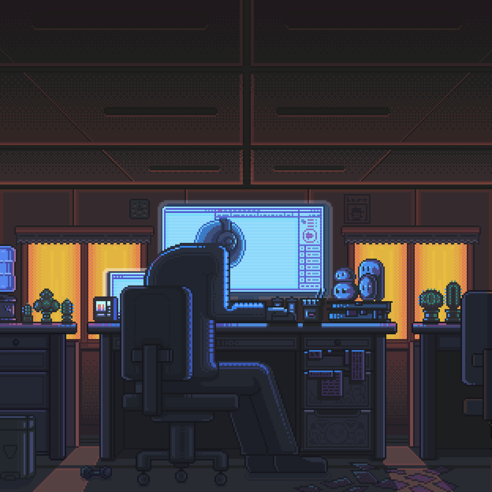

<div align="center">

<!-- ═══════════════════════════════════════════════════════════════ -->
<!--                        HERO SECTION                           -->
<!-- ═══════════════════════════════════════════════════════════════ -->



<br/>

<h1>
  
</h1>

<p>
  <em><strong>Building the future at the intersection of AI and software engineering.</strong></em><br/>
  Backend systems · LLM applications · Cloud infrastructure · Clean code.
</p>

<br/>

<!-- ── Social Links ── -->
<a href="https://github.com/didohm" target="_blank">
  
</a>
&nbsp;
<a href="https://www.linkedin.com/in/boumedienhimich" target="_blank">
  
</a>
&nbsp;
<a href="https://www.instagram.com/didohm_?igsh=bml2M2Z0Z2NxbWp4" target="_blank">
  
</a>
&nbsp;
<a href="https://didohm.qzz.io" target="_blank">
  
</a>
&nbsp;
<a href="mailto:77riezoff@gmail.com">
  
</a>

<br/><br/>


</div>

---

<!-- ═══════════════════════════════════════════════════════════════ -->
<!--                       ABOUT ME                                -->
<!-- ═══════════════════════════════════════════════════════════════ -->

<div align="center">
  <h2>⚡ About Me</h2>
</div>

```python
class BoumedienHimich:
    name        = "Boumedien Himich"
    alias       = "didohm"
    role        = "AI-Powered Full Stack Developer"
    location    = "Algeria 🇩🇿"
    motto       = "Focus. Discipline. Execution."

    currently   = [
        "Building modern web & mobile apps with Next.js, React Native & Flutter",
        "Developing scalable backends with Supabase & Firebase",
        "Creating AI-powered automation workflows with n8n & Make",
        "Building and customizing AI agents with OpenCode & OpenRouter",
    ]

    learning    = [
        "Advanced Next.js Architecture",
        "n8n Agentic Automation Systems",
        "AI Agent Development & LLM Orchestration",
    ]

    content     = "@dido.hub — AI, Web Development & Automation in Arabic"

    ask_me      = [
        "Next.js", "React", "React Native",
        "Supabase", "Firebase",
        "n8n Automation", "OpenCode", "AI Agents",
    ]

    def contact(self):
        return "77riezoff@gmail.com"
```

---

<!-- ═══════════════════════════════════════════════════════════════ -->
<!--                      SKILLS SHOWCASE                          -->
<!-- ═══════════════════════════════════════════════════════════════ -->

<div align="center">
  <h2>🛠️ Tech Stack & Skills</h2>
</div>

<details open>
<summary><b>🔙 Backend Development</b></summary>
<br/>
<div align="center">


</div>
</details>

<br/>

<details open>
<summary><b>🎨 Frontend Development</b></summary>
<br/>
<div align="center">


</div>
</details>

<br/>

<details open>
<summary><b>📱 Mobile Development</b></summary>
<br/>
<div align="center">


</div>
</details>

<br/>

<details open>
<summary><b>☁️ Cloud & DevOps</b></summary>
<br/>
<div align="center">


</div>
</details>

<br/>

<details open>
<summary><b>🗄️ Databases</b></summary>
<br/>
<div align="center">


</div>
</details>

<br/>

<details open>
<summary><b>⚡ Automation & AI Tools</b></summary>
<br/>
<div align="center">


&nbsp;

&nbsp;

&nbsp;

&nbsp;


</div>
</details>

<br/>

<details open>
<summary><b>🤖 AI & Soft Skills</b></summary>
<br/>
<div align="center">


</div>
</details>

<br/>

<details open>
<summary><b>🧰 Tools & Design</b></summary>
<br/>
<div align="center">


<br/>


&nbsp;


</div>
</details>

---

<!-- ═══════════════════════════════════════════════════════════════ -->
<!--                    GITHUB ANALYTICS                           -->
<!-- ═══════════════════════════════════════════════════════════════ -->

<div align="center">
  <h2>📊 GitHub Analytics</h2>
</div>

<div align="center">


</div>

<div align="center">
<br/>


</div>

<br/>

<!-- ── Profile Summary Cards (replaces broken trophies) ── -->
<div align="center">
  <h3>📈 Contribution Insights</h3>


<br/>


</div>

---

<!-- ═══════════════════════════════════════════════════════════════ -->
<!--                   CONTRIBUTION GRAPH                          -->
<!-- ═══════════════════════════════════════════════════════════════ -->

<div align="center">
  <h2>📈 Contribution Activity</h2>

[](https://github.com/didohm)

</div>

---

<!-- ═══════════════════════════════════════════════════════════════ -->
<!--                    WHAT I'M BUILDING                          -->
<!-- ═══════════════════════════════════════════════════════════════ -->

<div align="center">
  <h2>🚀 What I'm Currently Building</h2>
</div>

<div align="center">

| Project | Stack | Status |
|:--------|:------|:------:|
| 🎥 **VIKO** — Creator resources & workflow platform | Next.js · Firebase · Cloudinary · n8n | 🔵 Building |
| 📱 **ForGrowth** — AI study tools for Arabic students | React Native · Expo · Convex · OpenRouter | 🔵 Building |
| 📊 **Analyse Financière** — Crypto analytics dashboard | React · Node.js · MongoDB · Docker | 🟡 Active |
| 🌐 **Eclipse Website** — Organization landing page | Next.js · Supabase · Tailwind CSS | 🟡 Active |
| 📱 **@dido.hub** — Arabic tech & dev content | Instagram · Motion Graphics · n8n | 🟢 Active |

</div>

---

<!-- ═══════════════════════════════════════════════════════════════ -->
<!--                     FOOTER / CTA                              -->
<!-- ═══════════════════════════════════════════════════════════════ -->

<div align="center">

<h2>🤝 Let's Connect & Build</h2>

<p>
  Open to <strong>freelance projects</strong>, <strong>technical collaborations</strong>, and <strong>AI/backend engineering roles</strong>.<br/>
  Whether you're building a product, an API, or an intelligent system — let's talk.
</p>

<a href="mailto:77riezoff@gmail.com">
  
</a>
&nbsp;
<a href="https://didohm.qzz.io">
  
</a>

<br/><br/>


</div>
